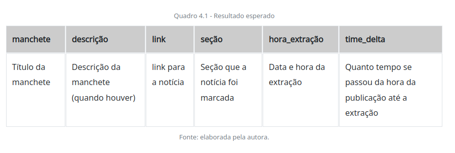

Em um artigo publicado no dia 06 de março de 2019, no portal Computer World, o autor fala sobre o profissional que deseja seguir a carreira de 
analista de dados, o qual deve ter habilidades em: filtrar dados, construir APIs, web scraping e ter conhecimento nas linguagens Git, MySQL e
 Python. (MOTIM, Raphael Bueno da. Carreira de analista de dados oferece salários de até R$ 12,5 mil. 2019.
 Disponível em: https://computerworld.com.br/2019/03/06/carreira-de-analista-de-dados-oferece-salarios-de-ate-r-125-mil/. Acesso em: 17 jun. 2020).

Como desenvolvedor em uma empresa de consultoria de software, você foi alocado em uma equipe de marketing analítico em uma marca esportiva, que 
necessita fazer a coleta das principais notícias do mundo de esporte em um determinado portal. O cliente pedi para que o 
portal https://globoesporte.globo.com/. O cliente deseja um componente capaz de fazer a extração dos dados em forma tabular, com 
o seguintes campos: manchete, descrição, link, seção, hora da extração, tempo decorrido da publicação até a hora da extração.

O Quadro 4.1 apresenta, visualmente, como os dados devem ser organizados e exibidos.

O grande desafio no trabalho de web scraping é descobrir qual o padrão nas tags HTML e atributos CSS usados. Pois somente através
deles é que conseguiremos alcançar a informação solicitada. Como o cliente já trabalha com o portal de notícias, foram lhe 
passadas as seguintes informações técnicas que o ajudarão a fazer a extração.

Para extração de todas as informações localize todas as div com atributo 'class':'feed-post-body'. De cada item localizado extraia:

- A manchete que ocupa a primeira posição do conteúdo.
- O link que pode ser localizado pela tag "a" e pelo atributo "href".
- A descrição pode estar na terceira posição conteúdo ou dentro de uma div com atributo 'class':'bstn-related'
- A seção está dentro de uma div com atributo 'class':'feed-post-metadata'. Localize o span com atributo 'class': 'feed-post-metadata-section'.
- O tempo decorrido está uma div com atributo 'class':'feed-post-metadata'. Localize o span com atributo 'class': 'feed-post-datetime'.

Caso tente acessar o texto de uma tag não localizada, um erro é dado, para evitar esses casos, os campos descrição, seção e time_delta 
devem ser tratados para esses casos, retornando None (nulo).

Agora é com você, faça a implementação e gere um DataFrame com as informações solicitadas.